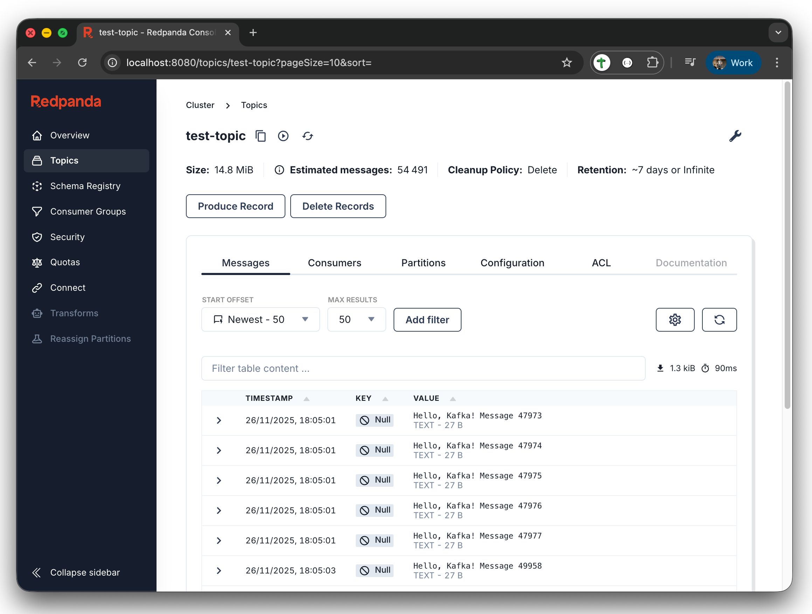

# Kafka with Strimzi on Kind

A complete setup for running Apache Kafka locally using Kubernetes-in-Docker (Kind) with the [Strimzi operator](https://strimzi.io) in KRaft mode, with:

* 3 Kafka brokers
* 1 topic with 12 partitions
* Producer that writes ~5 messages per second
* [Redpanda Console](https://github.com/redpanda-data/console)
* [Cruise Control](https://github.com/linkedin/cruise-control)
* [Prometheus](https://prometheus.io)
* [Redpanda KMinion](https://github.com/redpanda-data/kminion)



Manifests for each of the included services can be found in the [manifests folder](./manifests).

## Prerequisites

If running using Colima (Docker Desktop alternative), make sure you have enough resource, e.g.
```
colima start --memory 16 --cpu 6 --disk 200
```

Before running the setup, ensure you have the following installed:

- [Colima](https://github.com/abiosoft/colima) or [Docker Desktop](https://docs.docker.com/get-docker/) - For running Kind
- [Kind](https://kind.sigs.k8s.io/docs/user/quick-start/#installation) - Kubernetes in Docker
- [kubectl](https://kubernetes.io/docs/tasks/tools/) - Kubernetes command-line tool

## Quick Start

Run
```bash
./setup.sh
```

Then follow instructions on e.g. port-forward to access RedPanda UI.

1. **View demo messages**:
    ```bash
    kubectl -n kafka logs -f deployment/demo-producer
    ```

1. **Consume messages**:
    ```bash
    kubectl -n kafka run kafka-consumer --image=quay.io/strimzi/kafka:0.48.0-kafka-4.1.0 --rm -it --restart=Never -- bin/kafka-console-consumer.sh --bootstrap-server kafka-cluster-kafka-bootstrap:9092 --topic test-topic --from-beginning
    ```

## Rebalance cluster using Cruise Control

Create rebalance plan:
```
kubectl apply -f manifests/kafka-rebalance-full.yaml
```
After a while, it should say:
```
$ kubectl -n kafka get KafkaRebalance
NAME                CLUSTER         TEMPLATE   STATUS
cluster-rebalance   kafka-cluster              ProposalReady
```

Then approve proposals:
```
kubectl -n kafka annotate KafkaRebalance/cluster-rebalance-full strimzi.io/rebalance=approve
```

## Scale cluster

Modify number of replicas, then
```
$ kubectl -n kafka apply -f manifests/kafka-cluster.yaml
kafkanodepool.kafka.strimzi.io/broker configured
kafka.kafka.strimzi.io/kafka-cluster unchanged
kafkarebalance.kafka.strimzi.io/cluster-auto-rebalancing-template unchanged

$ kubectl -n kafka get kafkarebalance -w
NAME                                         CLUSTER         TEMPLATE   STATUS
cluster-auto-rebalancing-template                            true
kafka-cluster-auto-rebalancing-add-brokers   kafka-cluster              PendingProposal
kafka-cluster-auto-rebalancing-add-brokers   kafka-cluster              ProposalReady
kafka-cluster-auto-rebalancing-add-brokers   kafka-cluster              Rebalancing
kafka-cluster-auto-rebalancing-add-brokers   kafka-cluster              Ready
```

## Cleanup

Run
```
./cleanup.sh
```
