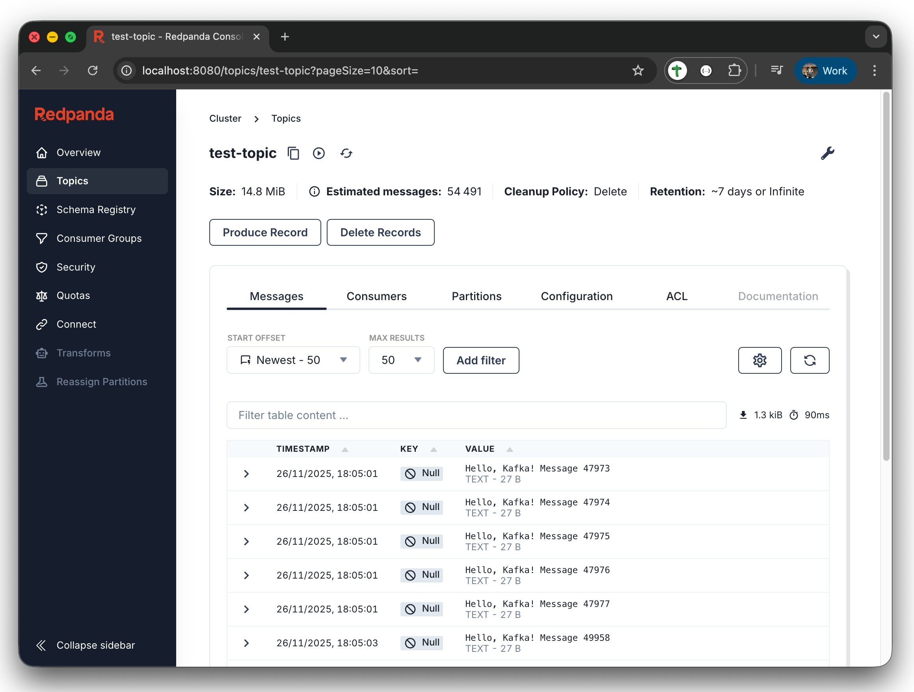

# Kafka with Strimzi on Kind

A complete setup for running Apache Kafka locally in Kubernetes-in-Docker (Kind) using the [Strimzi operator](https://strimzi.io) in KRaft mode, with:

* 3 Kafka brokers
* 1 topic with 12 partitions
* Producer that first writes 50K messages, then ~10 messages per second
* [Redpanda Console](https://github.com/redpanda-data/console)
* [Cruise Control](https://github.com/linkedin/cruise-control)
* [Prometheus](https://prometheus.io)
* [Redpanda KMinion](https://github.com/redpanda-data/kminion)



Manifests for each of the included services can be found in the [manifests folder](./manifests).

## Prerequisites

If running using Colima (Docker Desktop alternative), make sure you have enough resource, e.g.
```
colima start --memory 16 --cpu 6 --disk 200
```

**Raise the inotify limit.** The many pods in this stack exhaust Colima's default
`fs.inotify.max_user_instances` (128), which breaks `kubectl logs --follow` with
`failed to create fsnotify watcher: too many open files`
(a [known kind issue](https://kind.sigs.k8s.io/docs/user/known-issues/#pod-errors-due-to-too-many-open-files)).
Colima has no `sysctl` flag on `colima start`, so bake it into the VM's startup
provisioning. Run `colima start --edit` and add:
```yaml
provision:
  - mode: system
    script: sysctl -w fs.inotify.max_user_instances=512
```
This runs on every `colima start` (the script is idempotent). To apply it to an
already-running VM without a restart:
```
colima ssh -- sudo sysctl -w fs.inotify.max_user_instances=512
```

Before running the setup, ensure you have the following installed:

- [Colima](https://github.com/abiosoft/colima) or [Docker Desktop](https://docs.docker.com/get-docker/) - For running Kind
- [Kind](https://kind.sigs.k8s.io/docs/user/quick-start/#installation) - Kubernetes in Docker
- [kubectl](https://kubernetes.io/docs/tasks/tools/) - Kubernetes command-line tool

## Quick Start

Run
```bash
./setup.sh
```

Web UIs are exposed via nip.io ingress (printed at the end of setup):

* Redpanda Console: http://console.127.0.0.1.nip.io
* Prometheus: http://prometheus.127.0.0.1.nip.io

1. **View demo messages**:
    ```bash
    kubectl -n kafka logs -f deployment/demo-producer
    ```

1. **Produce additional messages**:
    ```bash
    cd demo-producer"
    go run . --brokers 127.0.0.1:9092 --topic other-topic --messages 20000
    ```

1. **Consume messages**:
    ```bash
    ./consume-messages.sh other-topic
    ```

## Connect from the host (no port-forward)

The Kafka cluster exposes a plaintext `nodeport` listener that kind maps to the
host, so clients on your machine connect directly:

```
bootstrap server: 127.0.0.1:9092
```

Kafka's bootstrap protocol then advertises the individual brokers as
`127.0.0.1:9093`, `127.0.0.1:9094` and `127.0.0.1:9095` (also mapped through
kind), which is why each broker gets its own host port. Point any Kafka client
or GUI at `127.0.0.1:9092` — no `kubectl port-forward` required.

> The listener is defined in [`manifests/kafka-cluster.yaml`](./manifests/kafka-cluster.yaml)
> and the host port mappings in [`manifests/kind-cluster.yaml`](./manifests/kind-cluster.yaml).
> Changing the port mappings requires recreating the kind cluster
> (`./cleanup.sh && ./setup.sh`).

## Rebalance cluster using Cruise Control

Create rebalance plan:
```
kubectl apply -f manifests/kafka-rebalance-full.yaml
```
After a while, it should say:
```
$ kubectl -n kafka get KafkaRebalance
NAME                CLUSTER         TEMPLATE   STATUS
cluster-rebalance   kafka-cluster              ProposalReady
```

Then approve proposals:
```
kubectl -n kafka annotate KafkaRebalance/cluster-rebalance-full strimzi.io/rebalance=approve
```

## Scale cluster

Modify number of replicas in [`manifests/kafka-cluster.yaml`](./manifests/kafka-cluster.yaml), then apply with the same substitution [`setup.sh`](./setup.sh) uses (from repo root):

```
$ source ./scripts/set-versions.sh
$ sed "s/__KAFKA_VERSION__/${KAFKA_VERSION}/g" manifests/kafka-cluster.yaml | kubectl apply -f - -n kafka
kafkanodepool.kafka.strimzi.io/broker configured
kafka.kafka.strimzi.io/kafka-cluster unchanged
kafkarebalance.kafka.strimzi.io/cluster-auto-rebalancing-template unchanged

$ kubectl -n kafka get kafkarebalance -w
NAME                                         CLUSTER         TEMPLATE   STATUS
cluster-auto-rebalancing-template                            true
kafka-cluster-auto-rebalancing-add-brokers   kafka-cluster              PendingProposal
kafka-cluster-auto-rebalancing-add-brokers   kafka-cluster              ProposalReady
kafka-cluster-auto-rebalancing-add-brokers   kafka-cluster              Rebalancing
kafka-cluster-auto-rebalancing-add-brokers   kafka-cluster              Ready
```

## Cleanup

Run
```
./cleanup.sh
```

## Batch sizes and `linger.ms`

When running producer, you can specify `--linger-ms` argument, which controls how long the consumer will wait before sending request to Kafka. By default this is 0, i.e. messages will be sent as soon as possible, typically resulting in 1 message per batch. By setting to e.g. `250 ms`, you can get bigger batch sizes and better compression, as shown in example here:

```
$ cd demo-producer

demo-producer $ go run . --brokers 127.0.0.1:9092 --topic linger-test --messages 2000 --delay 5 --linger-ms 0
2026/07/08 17:01:57 Created topic linger-test
2026/07/08 17:02:02 produced 1000 messages to topic linger-test (latest: Hello, Kafka! Message 999)
2026/07/08 17:02:08 produced 2000 messages to topic linger-test (latest: Hello, Kafka! Message 1999)
2026/07/08 17:02:08 Finished producing messages: 2000 succeeded, 0 failed

──────────────── run summary ────────────────
  linger.ms            : 0
  messages             : 2000 ok, 0 failed
  elapsed              : 10.90s
  throughput           : 184 msg/s
  batches written      : 1954
  records/batch        : avg 1.0 (min 1, max 12)
  bytes/batch (wire)   : avg 33
  wire bytes           : 0.06 MB (0.01 MB/s)
  uncompressed bytes   : 0.06 MB
  compression ratio    : 1.01x
─────────────────────────────────────────────

demo-producer $ go run . --brokers 127.0.0.1:9092 --topic linger-test --messages 2000 --delay 5 --linger-ms 250
2026/07/08 17:02:24 produced 1000 messages to topic linger-test (latest: Hello, Kafka! Message 999)
2026/07/08 17:02:29 produced 2000 messages to topic linger-test (latest: Hello, Kafka! Message 1999)
2026/07/08 17:02:29 Finished producing messages: 2000 succeeded, 0 failed

──────────────── run summary ────────────────
  linger.ms            : 250
  messages             : 2000 ok, 0 failed
  elapsed              : 10.98s
  throughput           : 182 msg/s
  batches written      : 65
  records/batch        : avg 30.8 (min 1, max 47)
  bytes/batch (wire)   : avg 361
  wire bytes           : 0.02 MB (0.00 MB/s)
  uncompressed bytes   : 0.07 MB
  compression ratio    : 2.82x
─────────────────────────────────────────────
```

You can verify that messages were written using
```
$ ./consume-messages.sh linger-test
```

`SIGINT` (Ctrl+C) and `SIGTERM` (Kubernetes graceful shutdown) interrupts are handled in code by flushing the buffer, so no messages should be lost.
